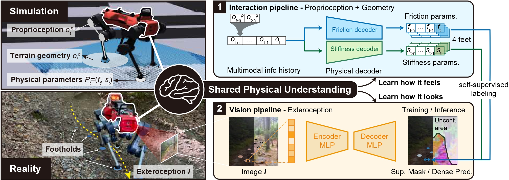
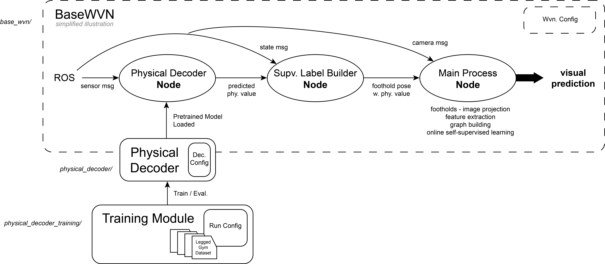

# Physical Terrain Parameters Learning



This repository accompanies the paper "Identifying Terrain Physical Parameters from Vision - Towards Physical-Parameter-Aware Locomotion and Navigation". Check project website [here](https://bit.ly/3Xo5AA8)

The repo mainly contains three parts: 
1. Stand-alone pre-trained physical decoder
2. Physical decoder training module
3. Self-supervised visual decoder learning


**Maintainer**: Jiaqi Chen 
**Affiliation**: ETH Zurich  
**Contact**: chenjiaq@student.ethz.ch 

If this code supports your research, please consider citing the following work. We also welcome feedback or collaboration opportunities:
```
@ARTICLE{Chen24physical,
  author={Chen, Jiaqi and Frey, Jonas and Zhou, Ruyi and Miki, Takahiro and Martius, Georg and Hutter, Marco},
  journal={IEEE Robotics and Automation Letters}, 
  title={Identifying Terrain Physical Parameters From Vision - Towards Physical-Parameter-Aware Locomotion and Navigation}, 
  year={2024},
  volume={9},
  number={11},
  pages={9279-9286},
  doi={10.1109/LRA.2024.3455788}}

```

## Codebase Overview


## 1. Stand-alone Pre-trained Physical Decoder (Folder: [physical_decoder](physical_decoder/))
You can try out our pre-trained physical decoder as follows:


### Installation
First, clone this repository to your local machine and install the dependencies.
```shell
cd physical_decoder/

# Install the dependencies
pip install -r requirements.txt

# Install the package
pip install -e .
```

### Explanation
This two decoders use sequence data as input and output a physical parameters sequence (friction or stiffness), where we extract the last sequence position as the prediction for the current timestamp. 
The main architecture is GRU+Self-Attention with a parallel structure.
The model_pth is automatically loaded from the package folder. 

#### ⚠️ Important: Shared Decoder Configuration

> **The file [`physical_decoder/physical_decoder/decoder_config.py`](physical_decoder/physical_decoder/decoder_config.py) is the **single source of truth** for decoder configurations.**

This file is used by **both**:
- `base_wvn`
- `physical_decoder_training`

✅ Make sure to **verify and modify configurations here** when changing model behavior for either component.

### Usage
Below we showcase how to use the decoders during deployment (e.g. in ros), you can also check the `base_wvn` folder for detailed ros usage.

```python
from physical_decoder import DeploymentWrapper

# Initializing
physical_decoder = DeploymentWrapper()

# Main loop
while True:
    # In deployment, the input data is usually an observation tensor per step with shape (batch_size, feature_dim)
    fric_pred, stiff_pred = physical_decoder.predict(input_data)
    # each output prediction is a tensor with shape (batch_size, priv_size = 4 feet)

```

## 2. Physical Decoder Training (Folder: [physical_decoder_training](physical_decoder_training/))

### Installation
```bash
cd physical_decoder_training
pip install -r requirements.txt
```

Set your Neptune API token, username and project name in the system file `.bashrc`:
```bash
export NEPTUNE_API_TOKEN="your_neptune_api_token"
export NEPTUNE_USERNAME="your_neptune_username"
export NEPTUNE_PROJECT="your_neptune_username/your_neptune_project_name"
```
### Training & Evaluation

1. Configure run parameters in [`physical_decoder_training/training_utils/run_config.py`](physical_decoder_training/training_utils/run_config.py). This includes:
    - `mode`: Set to 'train' for training+evaluation or 'eval' for evaluation-only.
    - `train_data_directory`, `val_data_directory`: Specify paths to your training and validation datasets.
    - `max_epochs`, `batch_size`, etc.: Adjust as needed.

2. Configure the decoder model settings in [`physical_decoder/physical_decoder/decoder_config.py`](physical_decoder/physical_decoder/decoder_config.py). This includes:
    - `seq_length`: Length of input sequences for RNNs.
    - `input_type`: Type of selected input features (e.g., 'pro', 'pro+exte', 'all').
    - `output_type`: Type of output parameter ('fric' for friction or 'stiff' for stiffness).
    - `device`: Set to 'cuda' for GPU training/inference or 'cpu' for CPU.
    - model architecture settings like `hidden_size`, etc.
    
3. The main training & evaluation loop is in `physical_decoder_training/train_eval.py`

Be advised that the datasets are seperated for friction and stiffness prediction, and the training is also seperated. Change the `output_type` in the decoder config for different decoders training. For detailed information, please refer to code.

You may use our pre-collected dataset for training. Download the `dataset` folder from [this link](https://drive.google.com/drive/folders/1GiX66anCw4DuOGTlS3FzBez0hATTrJbL?usp=drive_link). Specify the paths for training and validation data in the configuration file.


### Usage
```bash
python physical_decoder_training/train_eval.py
```
## 3. Self-supervised Visual Decoder Learning (Folder: [base_wvn](base_wvn/))

Please check the Readme in `base_wvn` folder for detailed instructions.
