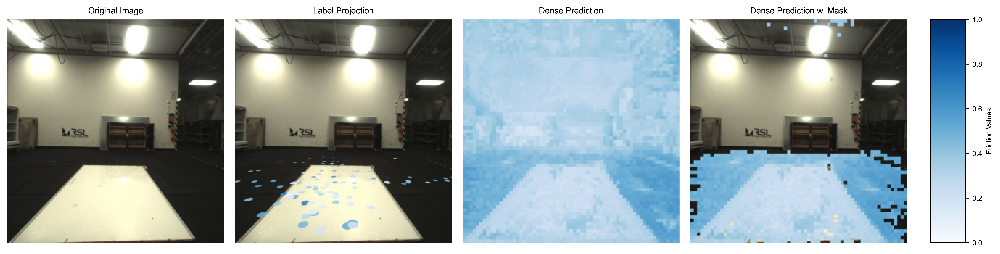
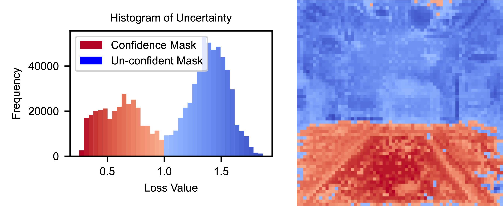
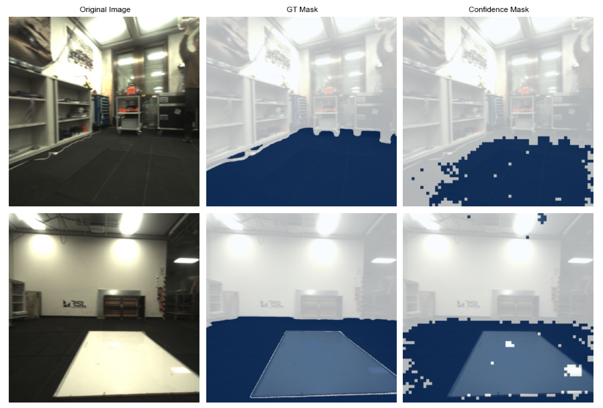

#  Self-supervised Visual Decoder Learning
This code is for online training of the visual decoder to predict the physical terrain paramters estimated by the physical decoder from images. The pipeline is based on the previous repo from "[Fast Traversability Estimation for Wild Visual Navigation](https://github.com/leggedrobotics/wild_visual_navigation)".

## Improvements beyond the paper
1. **New Confidence mask generator (gmm_1d_history)**: Maintaining a short history of reconstruction loss of the footholds (they are absolute confident area), to avoid arbitrary confidence mask splitting when transitioning to a new scene. It is now enabled by default.

2. **New visual decoder (SeperateMLP)**: Seperating the loss reconstruction and physical value prediction as two independent MLPs, which stabilizes the training. It is now enabled by default.

## Compatibility with [GrandTour dataset](https://grand-tour.leggedrobotics.com/)
This code is compatible with the GrandTour dataset, which is the largest legged robotic dataset collected using an ANYbotics ANYmal D quadruped robot equipped with Boxi, a state-of-the-art, fully open-source sensor payload. Please follow the [instructions](https://github.com/leggedrobotics/grand_tour_dataset) to install the dataset. 

## Installation
**Attention**: Please follow the installation order exactly as below. Otherwise, you may encounter some errors. Here we use mamba for virtual environment management with **Python 3.9**
### Install robostack ros first:
https://robostack.github.io/GettingStarted.html

then you can do `mamba install ros-noetic-plotjuggler-ros`

### Install pytorch next:

```bash
mamba install pytorch torchvision torchaudio pytorch-cuda=12.1 -c pytorch -c nvidia
```
### Install other dependencies:
```bash
pip install -r requirements.txt
```
If you encounter any errors, please follow the error message to install the missing dependencies.

**Attention**: As a prerequest you need to pip install the [Stand-alone pre-trained physical decoder](phy_decoder/README.md). Also install the package from https://github.com/utiasSTARS/liegroups.git and https://github.com/facebookresearch/segment-anything.git. Please also put [ros-comm](https://github.com/leggedrobotics/ros_comm) under src folder to avoid ros comm bugs during real-time running. You need to sudo apt install `tmux`.

Set you neptune API token, username, and project name in the system file `.bashrc`:
```bash
export NEPTUNE_API_TOKEN="your_neptune_api_token"
export NEPTUNE_USERNAME="your_neptune_username"
export NEPTUNE_PROJECT="your_neptune_username/your_neptune_project_name"
```

### Install this base_wvn package:
```bash
pip install -e .
```

### (Optional) Install the package from GrandTour dataset after finishing their [installation](https://github.com/leggedrobotics/grand_tour_dataset):
```bash
ln -s ~/git/grand_tour_dataset/examples_ros1 ~/physical_terrain_parameter_learning/base_wvn/src/  # if you need to avoid overlaying workspaces
```

### Build the base_wvn with ROS:
```bash
catkin build wild_visual_navigation_ros
catkin build examples_ros1                     # (Optional) if you need to avoid overlaying workspaces for using GrandTour dataset
source devel/setup.bash
export PATH="$CONDA_PREFIX/bin:$PATH"          # (Optional) if you are using conda environment and experiencing missing python path after sourcing the workspace 
```

## General configuration
All configs are set in [base_wvn/config/wvn_cfg.py](base_wvn/config/wvn_cfg.py), for all the training/testing, you should pay attention to path-related settings. Some important parameters are listed below:

1. `roscfg.phy_decoder_input_topic`: this is hard-coded topic for Anymal D, do not change it.
2. `roscfg.camera_topic` and `roscfg.camera_info_topic`: these are the camera topics for the images, you should use the camera pointing along and towards the walking direction. If the camera tf is not provided in config, you need to implement it yourself and update related entry in ros node scripts in [src/wild_visual_navigation_ros/scripts](src/wild_visual_navigation_ros/scripts).
3. `roscfg.use_vo`: only set to `True` if there is the specific open3d_slam topic, otherwise set to `False`, then it will use the default anymal_state_topic.
4. `general.pub_which_pred`: set to `fric` will only publish the masked dense friction prediction img, under the topic `/vd_pipeline/friction`, and set to `stiff` will only publish the stiffness prediction img, under the topic `/vd_pipeline/stiffness`.
5. `graph.{}`: graph-related parameters, could require tuning in new scenes, such as `graph.edge_dist_thr_main_graph`, depending on the different scales of the scenes.
6. `graph.label_ext_mode`: if set to `True`, it will record the online collected data (nodes, training batches) for potential offline training. 
7. `offline.mode`: set to `train` or `eval` for offline train+eval or eval-only, respectively.
8. `offline.env`: the environment name, which should match the folder name where the training data is stored, such as `snow` for `base_wvn/results/manager/train/snow`.
9. `offline.replicate_online_training`: if set to `True`, it will use the recorded data to perform offline model training in the exact order as it will be used during the online training, otherwise it will randomly sample the recorded training data.
10. `offline.test_on_images/nodes`: if set to `True`, it will test the model on the images or recorded nodes. It should be set together with `offline.plot_hist/nodes/masks_compare` to visualize the prediction results. Please see below for the example visualization.
11. `offline.test_video`: if set to `True`, it will generate a visual prediction video from the given rosbag in `offline.img_bag_path` containing the desired camera img topic, please see below for the example visualization.


## Online training

### Running
For different configs, please refer to the code and config file.
```bash
./src/wild_visual_navigation_ros/scripts/play_base_wvn.sh  # start all base_wvn nodes

# (Optional.1) start rosbag playing, you can train online with rosbag playing, but you need to make sure the rosbag path is set to your own ones in `play_rosbag.sh` 
roslaunch wild_visual_navigation_ros play.launch 

# (Optional.2) start rosbag playing in GrandTour dataset
roslaunch grand_tour_ros1 lidars.launch
rosrun grand_tour_ros1 rosbag_play.sh *.bag # after cd into the folder containing the bag files
```

### Tmux usage
`Ctrl+B` then press `arrow keys` to switch between panels in the cli and use `Ctrl+C` to stop. To kill the tmux session, press your prefix (e.g. `Ctrl+A` or `B`, which is the default) and then `:` and type `kill-session`, then hit `Enter`.

## Offline training
Download segment_anything model checkpoint from [here](https://drive.google.com/file/d/1TU3asknvo1UKdhx0z50ghHDt1C_McKJu/view?usp=drive_link) and speicify the path in the config file.
### Extracting offline dataset
It is generated from the online rosbag playing. By setting `label_ext_mode: bool=True` you can record the dataset. The corresponding settings and paths are in config file.  Please change the paths in the `play_base_wvn.sh` file to your own paths.

You need to make sure the rosbag path is set to your own ones in `play_rosbag.sh` before executing the following.
```bash
./src/wild_visual_navigation_ros/scripts/play_base_wvn.sh  # start all base_wvn nodes

roslaunch wild_visual_navigation_ros play.launch # start rosbag playing or using the rosbag playing in GrandTour dataset

# Follow Tmux usage and use `Ctrl+C` to stop the recording.
```
### Tmux usage
`Ctrl+C` in the **left-most** panel will also finish the recording.

### Dataset structure
The default saving path is `~/base_wvn/results/manager` with the following files:

- `train_data.pt`: only store the training data pairs, which are the same for online training

- `train_nodes.pt`:store all main nodes with all information

After running offline training for the first time, you will get additional files:

- `gt_masks_SAM.pt`: all the automatically generated GT masks from SAM
- `mask_img.pt`: the corresponding color image of the GT masks above
  
You need to put the above files into a seperate folder, specifying `train` or `val` and followed by the env name, like `~/base_wvn/results/manager/train/snow`. The env name should match the one in the config file. 


### Manual correction of GT masks
Beacause the automatically generated GT masks (from SAM) are not perfect, we need to manually correct them with segments.ai . 

You can use the `base_wvn/offline/seg_correction.py` to correct the masks. The detailed usage you can refer to the code.
### Running
For offline training/testing, you can switch the config and run the following command:
```bash
python base_wvn/offline/train_eval.py
```
### Visualization Example
1. Dense prediction from imgs stored in nodes by setting `param.offline.plot_nodes=True`: 
<p align="center">
    
</p>

2. Dense prediction video from the given rosbag in `offline.img_bag_path` by setting `offline.test_video=True`:
<p align="center">
    
</p>

3. Reconstruction loss / confidence visualization by setting `param.offline.plot_hist=True`:
<p align="center">
    
</p>

4. Compare the estimated confidence masks with the GT masks by setting `param.offline.plot_masks_compare=True`:
<p align="center">
    
</p>


## Acknowledgements

This pipeline includes code from the following open-source project(s) licensed under the MIT License:

- [wild_visual_navigation](https://github.com/leggedrobotics/wild_visual_navigation) by Matias Mattamala, Jonas Frey